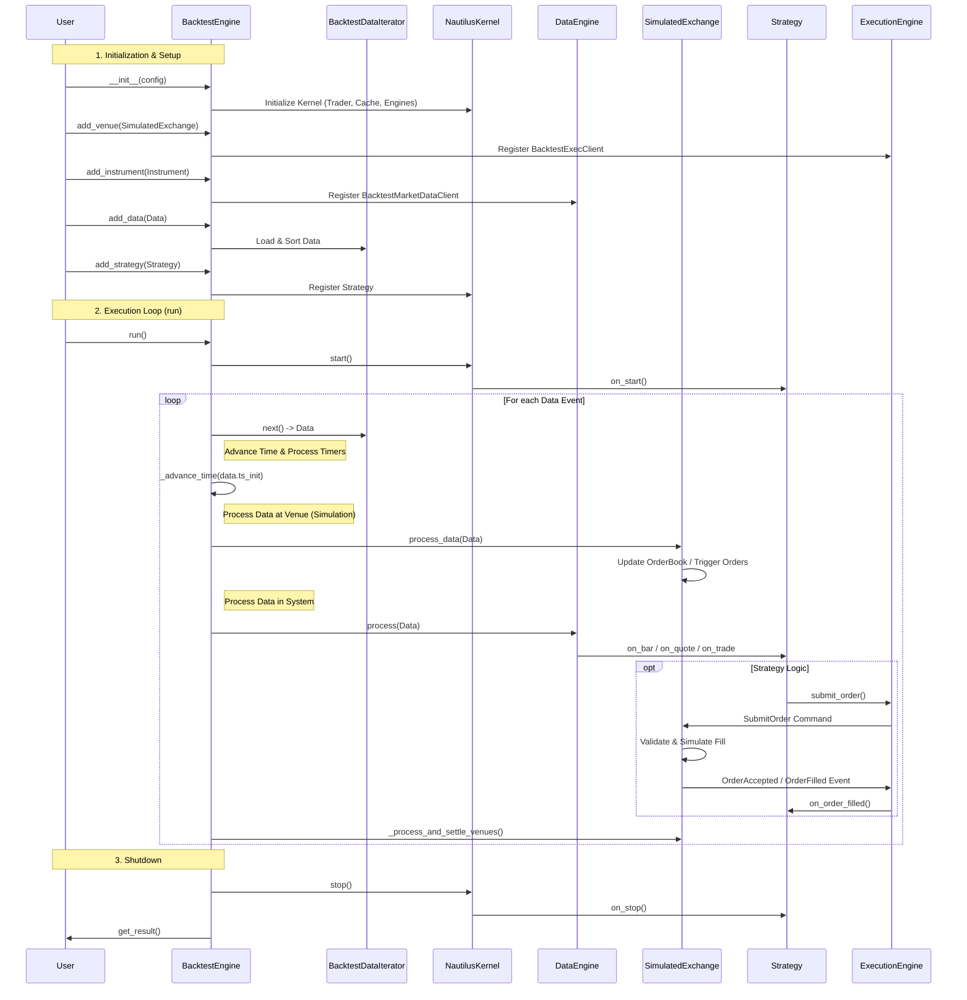
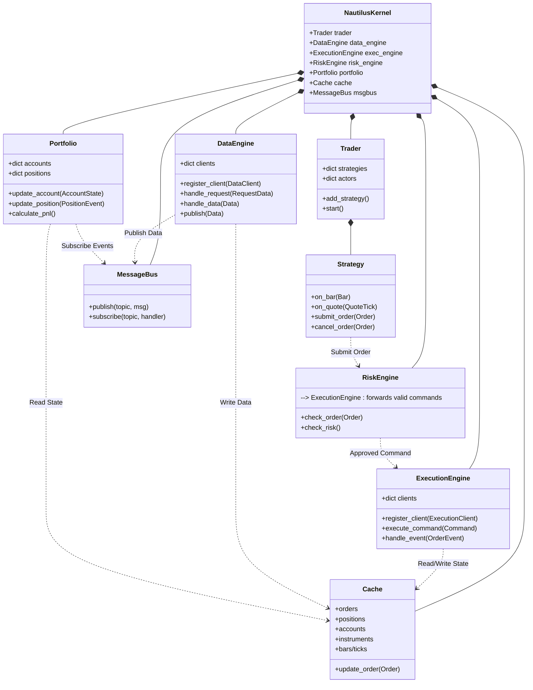
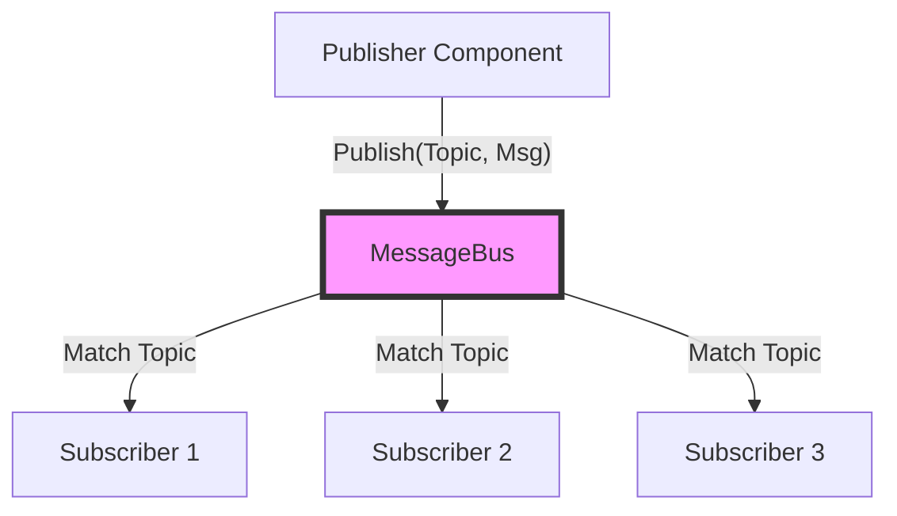
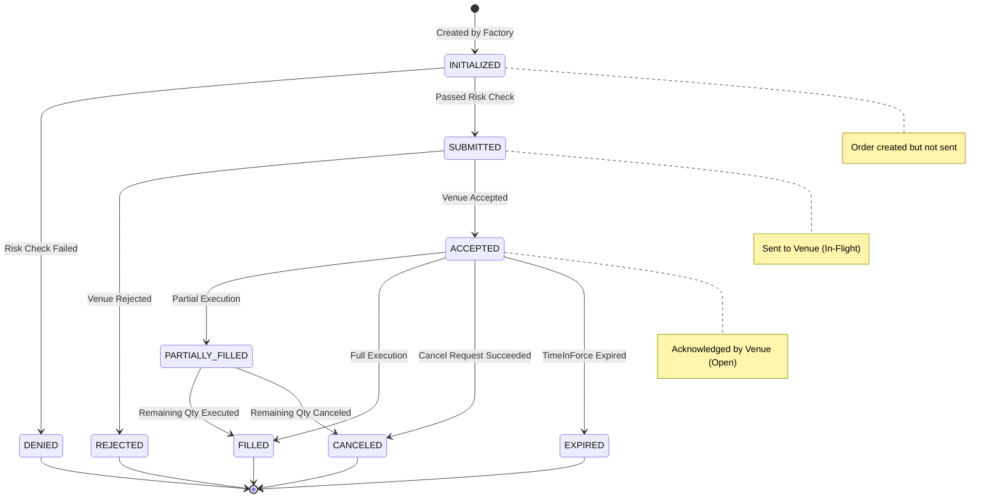

# NautilusTrader 源码学习笔记

## 1. 系统工作流 (System Workflow)

NautilusTrader 的回测系统围绕 `BacktestEngine` 展开，它协调数据加载、时钟同步、事件分发和模拟交易。整个过程是一个离散事件模拟（Discrete Event Simulation）。

### 核心流程图 (Mermaid Sequence Diagram)

### 流程详解

1.  **初始化阶段**:
    -   用户配置 `BacktestEngine`，定义交易所（Venue）、合约（Instrument）和初始资金。
    -   加载历史数据，`BacktestDataIterator` 负责将多路数据源按时间戳排序合并。
    -   注册策略，策略被包装在 `Trader` 组件中。

2.  **事件循环 (Main Loop)**:
    -   引擎从迭代器中取出一份数据（Bar, Quote, Trade 等）。
    -   **时间推进**: 调用 `_advance_time`，利用 `TimeEventAccumulator` 处理所有在当前数据时间戳之前的定时器事件（例如策略设置的 `call_later`）。
    -   **交易所模拟**: 数据首先流向 `SimulatedExchange`，更新交易所内部的订单簿状态，检查是否有订单被触发或成交（模拟撮合）。
    -   **数据分发**: 数据随后进入 `DataEngine`，通过 `MessageBus` 分发给订阅了该数据的组件（主要是策略）。
    -   **策略响应**: 策略的回调函数（如 `on_bar`）被触发。策略可以发出交易指令。
    -   **指令处理**: 交易指令（`SubmitOrder`）经由 `ExecutionEngine` 发送到 `SimulatedExchange`。交易所立即处理（如果是市价单或满足条件的限价单），生成执行报告事件（`OrderFilled`），这些事件再次回调到策略。

3.  **结束阶段**:
    -   数据耗尽或到达结束时间，循环终止。
    -   触发组件的停止生命周期方法。
    -   生成统计报告。

## 2. 核心组件与架构 (Core Components & Architecture)

系统采用基于组件（Component-based）的架构，通过 `NautilusKernel` 进行统一管理。各组件职责分明，通过 `MessageBus` 异步通信或直接方法调用（在同一进程内优化性能）。

### 组件关系图 (Mermaid Class/Component Diagram)

### 组件功能解析

1.  **Trader (交易员)**:
    -   **角色**: 策略容器和管理器。
    -   **功能**: 管理策略生命周期（启动、停止、重置）。持有对其他所有核心引擎的引用，并将这些引用注入到策略中，使策略能够访问数据、提交订单和查询状态。

2.  **Strategy (策略)**:
    -   **角色**: 用户逻辑的实现者。
    -   **功能**: 继承自 `Actor`。响应市场数据事件（`on_bar`, `on_quote`）和交易事件（`on_order_filled`）。通过 `submit_order` 创建交易指令。它不直接操作底层，而是通过 `RiskEngine` 或 `ExecutionEngine` 代理。

3.  **DataEngine (数据引擎)**:
    -   **角色**: 数据的摄入与分发中心。
    -   **功能**: 管理 `DataClient`（连接不同数据源）。处理数据订阅请求。接收原始数据，进行标准化处理，更新 `Cache`，并通过 `MessageBus` 发布给订阅者。支持历史数据回放和实时数据流。

4.  **ExecutionEngine (执行引擎)**:
    -   **角色**: 交易指令的路由与执行管理。
    -   **功能**: 管理 `ExecutionClient`（连接交易所）。接收 `TradingCommand`（如 `SubmitOrder`），根据 Venue 路由到对应的 Client。接收交易所的反馈（`OrderEvent`），更新订单状态，并通知系统的其他部分。

5.  **RiskEngine (风控引擎)**:
    -   **角色**: 交易前的看门人（Pre-trade Risk Check）。
    -   **功能**: 在订单发往交易所前拦截指令。执行风控检查（如：资金是否足够、最大持仓限制、订单频率限制）。如果检查通过，将指令转发给 `ExecutionEngine`；否则拒绝指令并触发 `OrderDenied` 事件。

6.  **Portfolio (投资组合)**:
    -   **角色**: 账户与持仓状态的维护者。
    -   **功能**: 监听订单和成交事件，实时计算账户余额（Balance）、保证金（Margin）、持仓（Position）和盈亏（PnL）。它维护了账户的“会计视图”。

7.  **Cache (缓存)**:
    -   **角色**: 全局状态数据库。
    -   **功能**: 存储所有关键对象（Orders, Positions, Accounts, Instruments, Bars 等）。所有引擎都依赖 Cache 来获取最新状态。它提供了高效的索引查询（例如按 Venue、Strategy 或 Instrument 查找订单）。

8.  **MessageBus (消息总线)**:
    -   **角色**: 组件间的神经系统。
    -   **功能**: 实现发布-订阅模式。解耦了各个组件，使得系统高度模块化。在回测模式下，它是同步直接调用的（为了速度）；在实时模式下，它可以是异步的。

## 3. 事件驱动机制与数据流 (Event-Driven Mechanism & Data Flow)

NautilusTrader 的高性能核心在于其事件驱动的设计。

### 事件总线架构 (MessageBus Architecture)

MessageBus 是一个发布-订阅（Pub/Sub）系统。它支持通配符主题（Wildcard Topics），使得组件可以灵活地订阅一类事件。

-   **实现**: `nautilus_trader/common/component.pyx`
-   **主题示例**:
    -   `data.quotes.BINANCE.BTCUSDT`: 币安 BTCUSDT 的报价数据。
    -   `events.order.Strategy001`: 策略 Strategy001 的订单事件。
    -   `events.account.ACCT001`: 账户 ACCT001 的资金变动。

### 数据流向 (Data Flow)

数据从外部源进入系统，经过处理后到达策略，最终可能转化为交易指令。

1.  **数据摄入**: `DataClient` 接收外部数据（Websocket/REST/File）。
2.  **标准化**: 数据被转换为 Nautilus 的内部格式（如 `QuoteTick`, `Bar`）。
3.  **引擎处理**: `DataEngine` 接收数据，更新 `Cache`（例如更新最新的报价）。
4.  **分发**: `DataEngine` 将数据发布到 `MessageBus`。
5.  **消费**: 订阅了该数据的 `Strategy` (Actor) 收到回调。

### 时钟与时间推进 (Clock & Time Advancement)

在回测中，时间是离散推进的。

-   **TimeEventAccumulator**: 一个基于 Rust 的优先队列，按时间戳顺序存储待处理的定时器事件（Timer Events）。
-   **_advance_time**: 回测引擎每次处理新的数据点前，会先调用此方法。它会检查 Accumulator 中是否有时间戳早于当前数据点的事件。如果有，先执行这些事件（例如策略设定的 `call_later` 回调），从而保证因果律（Causality）不被破坏。

## 4. 订单生命周期与状态管理 (Order Lifecycle & State Management)

订单状态管理是交易系统的核心。NautilusTrader 使用有限状态机（FSM）来管理订单状态。

### 订单状态流转图 (Order State Machine)

### 关键阶段详解

1.  **创建 (Creation)**:
    -   策略调用 `order_factory.limit(...)` 创建订单对象。此时状态为 `INITIALIZED`。

2.  **提交 (Submission)**:
    -   策略调用 `submit_order(order)`。
    -   **风控检查**: `RiskEngine` 拦截指令，检查资金、持仓限额等。
    -   **通过**: 状态转为 `SUBMITTED`（此时也称为 In-Flight），指令发往 `ExecutionEngine`。
    -   **拒绝**: 如果风控不通过，生成 `OrderDenied` 事件，状态转为 `DENIED`，流程结束。

3.  **确认 (Acknowledgement)**:
    -   交易所收到指令并确认有效。
    -   生成 `OrderAccepted` 事件。
    -   `ExecutionEngine` 收到事件，更新订单状态为 `ACCEPTED`（此时也称为 Open）。

4.  **执行 (Execution)**:
    -   订单在交易所撮合成交。
    -   生成 `OrderFilled` 事件。
    -   如果成交数量 < 订单总量，状态转为 `PARTIALLY_FILLED`。
    -   如果成交数量 == 订单总量，状态转为 `FILLED`（Closed）。

5.  **撤单 (Cancellation)**:
    -   策略发出 `CancelOrder` 指令。
    -   订单进入 `PENDING_CANCEL` 状态。
    -   交易所确认撤单，生成 `OrderCanceled` 事件，状态转为 `CANCELED`（Closed）。
