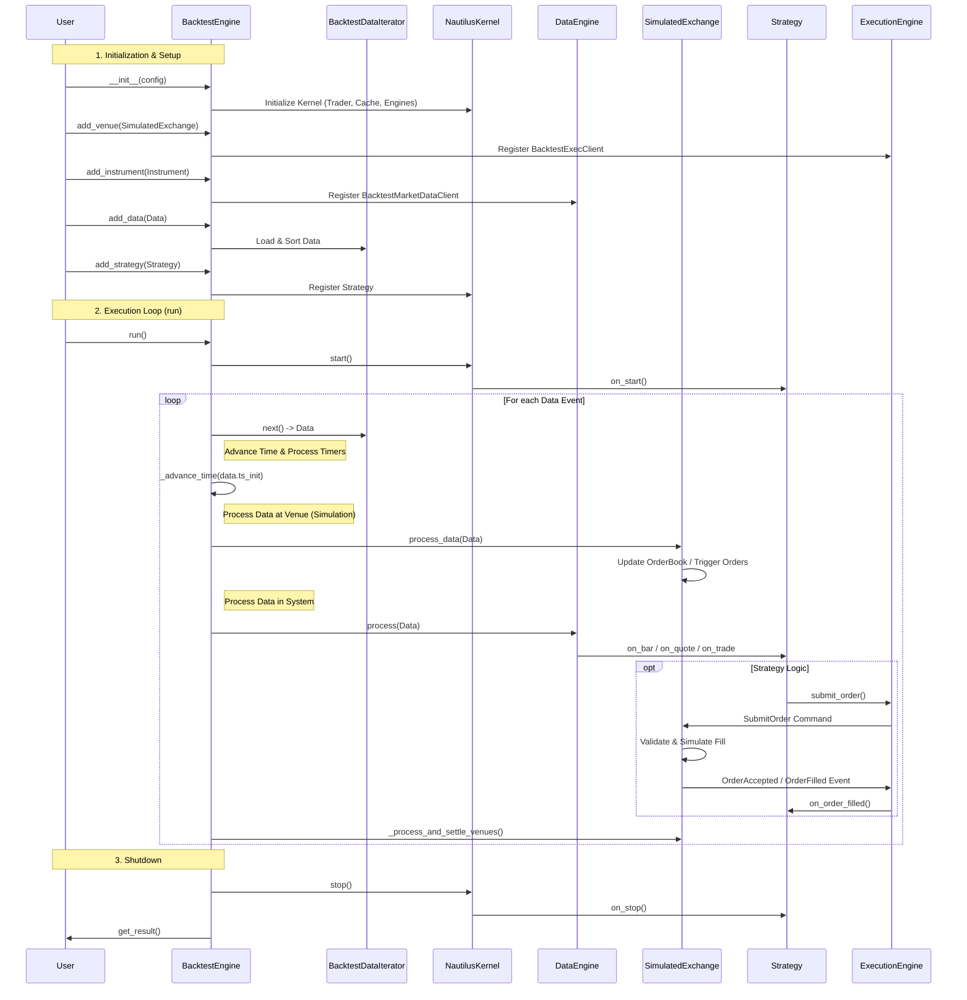
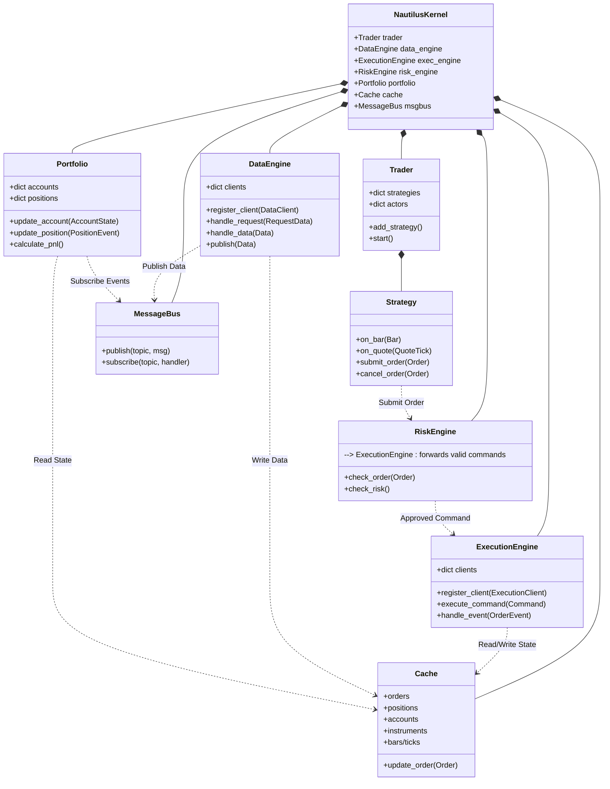
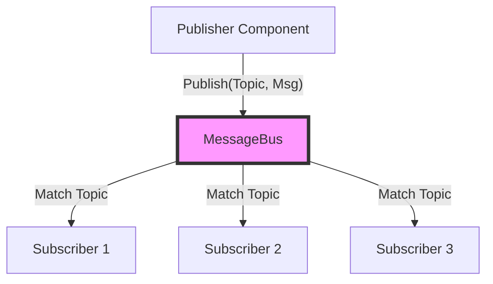
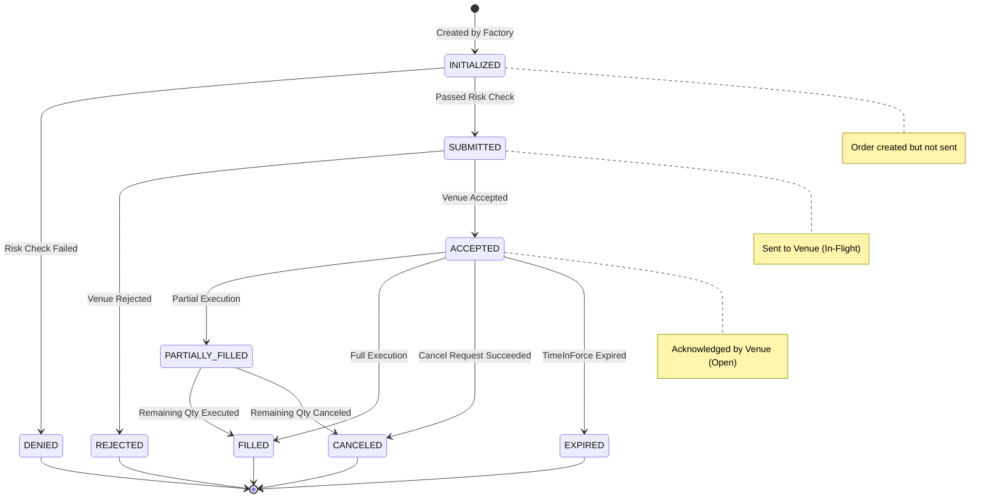

# NautilusTrader Source Code Learning Notes

## 1. System Workflow

The backtesting system of NautilusTrader revolves around `BacktestEngine`, which coordinates data loading, clock synchronization, event dispatching, and simulated trading. The entire process is a Discrete Event Simulation.

### Core Process Flow Chart (Mermaid Sequence Diagram)

### Process Details

1.  **Initialization Phase**:
    -   Users configure `BacktestEngine`, defining the exchange (Venue), instruments (Instrument), and initial capital.
    -   Historical data is loaded, and `BacktestDataIterator` is responsible for merging multiple data sources sorted by timestamp.
    -   Strategies are registered, and the strategy is wrapped within the `Trader` component.

2.  **Event Loop (Main Loop)**:
    -   The engine retrieves a piece of data (Bar, Quote, Trade, etc.) from the iterator.
    -   **Time Advancement**: Calls `_advance_time`, using `TimeEventAccumulator` to process all timer events scheduled before the current data timestamp (e.g., `call_later` set by the strategy).
    -   **Exchange Simulation**: Data first flows to `SimulatedExchange`, updating the internal order book state of the exchange and checking for triggered or filled orders (simulated matching).
    -   **Data Distribution**: Data then enters `DataEngine` and is distributed via `MessageBus` to components that subscribed to the data (primarily strategies).
    -   **Strategy Response**: Strategy callback functions (such as `on_bar`) are triggered. The strategy can issue trading commands.
    -   **Command Processing**: Trading commands (`SubmitOrder`) are sent to `SimulatedExchange` via `ExecutionEngine`. The exchange processes them immediately (if market orders or limit orders meeting conditions), generating execution report events (`OrderFilled`), which callback to the strategy again.

3.  **Termination Phase**:
    -   The loop terminates when data is exhausted or the end time is reached.
    -   Stop lifecycle methods of components are triggered.
    -   Statistical reports are generated.

## 2. Core Components & Architecture

The system adopts a Component-based architecture, managed uniformly by `NautilusKernel`. Each component has clear responsibilities and communicates asynchronously via `MessageBus` or through direct method calls (optimized within the same process).

### Component Relationship Diagram (Mermaid Class/Component Diagram)

### Component Function Analysis

1.  **Trader**:
    -   **Role**: Strategy container and manager.
    -   **Function**: Manages strategy lifecycle (start, stop, reset). Holds references to all other core engines and injects these references into the strategy, enabling the strategy to access data, submit orders, and query states.

2.  **Strategy**:
    -   **Role**: Implementer of user logic.
    -   **Function**: Inherits from `Actor`. Responds to market data events (`on_bar`, `on_quote`) and trade events (`on_order_filled`). Creates trading orders via `submit_order`. It does not operate on the lower level directly but proxies through `RiskEngine` or `ExecutionEngine`.

3.  **DataEngine**:
    -   **Role**: Center for data ingestion and distribution.
    -   **Function**: Manages `DataClient` (connecting to different data sources). Handles data subscription requests. Receives raw data, standardizes it, updates `Cache`, and publishes it to subscribers via `MessageBus`. Supports historical data replay and real-time data streams.

4.  **ExecutionEngine**:
    -   **Role**: Routing and execution management of trading commands.
    -   **Function**: Manages `ExecutionClient` (connecting to exchanges). Receives `TradingCommand` (e.g., `SubmitOrder`) and routes to the corresponding Client based on Venue. Receives feedback from exchanges (`OrderEvent`), updates order states, and notifies other parts of the system.

5.  **RiskEngine**:
    -   **Role**: Gatekeeper before trading (Pre-trade Risk Check).
    -   **Function**: Intercepts commands before orders are sent to the exchange. Performs risk checks (e.g., sufficient funds, maximum position limits, order frequency limits). If the check passes, forwards the command to `ExecutionEngine`; otherwise, rejects the command and triggers an `OrderDenied` event.

6.  **Portfolio**:
    -   **Role**: Maintainer of account and position states.
    -   **Function**: Listens to order and fill events, calculating account balance, margin, position, and PnL in real-time. It maintains the "accounting view" of the account.

7.  **Cache**:
    -   **Role**: Global state database.
    -   **Function**: Stores all key objects (Orders, Positions, Accounts, Instruments, Bars, etc.). All engines rely on Cache to retrieve the latest state. It provides efficient index queries (e.g., finding orders by Venue, Strategy, or Instrument).

8.  **MessageBus**:
    -   **Role**: The nervous system between components.
    -   **Function**: Implements the publish-subscribe pattern. Decouples components, making the system highly modular. In backtesting mode, it is invoked synchronously and directly (for speed); in real-time mode, it can be asynchronous.

## 3. Event-Driven Mechanism & Data Flow

The high-performance core of NautilusTrader lies in its event-driven design.

### MessageBus Architecture

MessageBus is a publish-subscribe (Pub/Sub) system. It supports Wildcard Topics, allowing components to flexibly subscribe to a class of events.

-   **Implementation**: `nautilus_trader/common/component.pyx`
-   **Topic Examples**:
    -   `data.quotes.BINANCE.BTCUSDT`: Quote data for Binance BTCUSDT.
    -   `events.order.Strategy001`: Order events for strategy Strategy001.
    -   `events.account.ACCT001`: Fund changes for account ACCT001.

### Data Flow

Data enters the system from external sources, is processed, reaches the strategy, and may eventually be converted into trading commands.

1.  **Data Ingestion**: `DataClient` receives external data (Websocket/REST/File).
2.  **Standardization**: Data is converted into Nautilus internal formats (e.g., `QuoteTick`, `Bar`).
3.  **Engine Processing**: `DataEngine` receives data, updates `Cache` (e.g., updating the latest quotes).
4.  **Distribution**: `DataEngine` publishes data to `MessageBus`.
5.  **Consumption**: `Strategy` (Actor) subscribed to this data receives callbacks.

### Clock & Time Advancement

In backtesting, time advances discretely.

-   **TimeEventAccumulator**: A Rust-based priority queue that stores pending timer events sorted by timestamp.
-   **_advance_time**: Before processing a new data point, the backtest engine calls this method. It checks if there are events in the Accumulator with timestamps earlier than the current data point. If so, these events are executed first (e.g., `call_later` callbacks set by strategies), ensuring causality is preserved.

## 4. Order Lifecycle & State Management

Order state management is the core of the trading system. NautilusTrader uses a Finite State Machine (FSM) to manage order states.

### Order State Machine

### Key Stages Details

1.  **Creation**:
    -   Strategy calls `order_factory.limit(...)` to create an order object. The state is `INITIALIZED`.

2.  **Submission**:
    -   Strategy calls `submit_order(order)`.
    -   **Risk Check**: `RiskEngine` intercepts the command, checking funds, position limits, etc.
    -   **Passed**: State transitions to `SUBMITTED` (also known as In-Flight), and the command is sent to `ExecutionEngine`.
    -   **Denied**: If risk check fails, an `OrderDenied` event is generated, state transitions to `DENIED`, and the process ends.

3.  **Acknowledgement**:
    -   The exchange receives the command and confirms validity.
    -   Generates an `OrderAccepted` event.
    -   `ExecutionEngine` receives the event, updating order state to `ACCEPTED` (also known as Open).

4.  **Execution**:
    -   The order is matched and executed at the exchange.
    -   Generates an `OrderFilled` event.
    -   If executed quantity < total order quantity, state transitions to `PARTIALLY_FILLED`.
    -   If executed quantity == total order quantity, state transitions to `FILLED` (Closed).

5.  **Cancellation**:
    -   Strategy issues a `CancelOrder` command.
    -   Order enters `PENDING_CANCEL` state.
    -   The exchange confirms cancellation, generates an `OrderCanceled` event, and state transitions to `CANCELED` (Closed).
